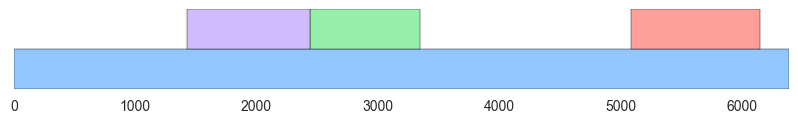

# GeneFinder

This is a solution to the gene-finder mini project.

## Installation

    $ sudo pip3 install matplotlib seaborn

## Usage

    $ python3 gene_plot.py

This locates genes in the sequence in `data/X73525.fa`, and writes the result into `gene.png`:

The name of the path to load the data from, the number of trials to find the threshold, and the name of the output file are all currently hardcoded.
